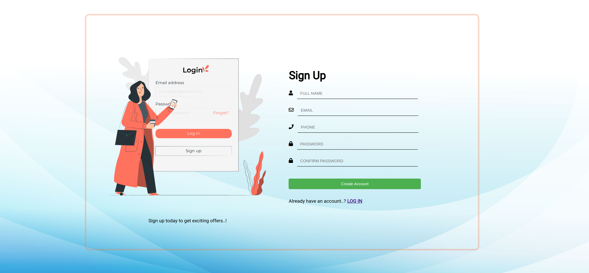
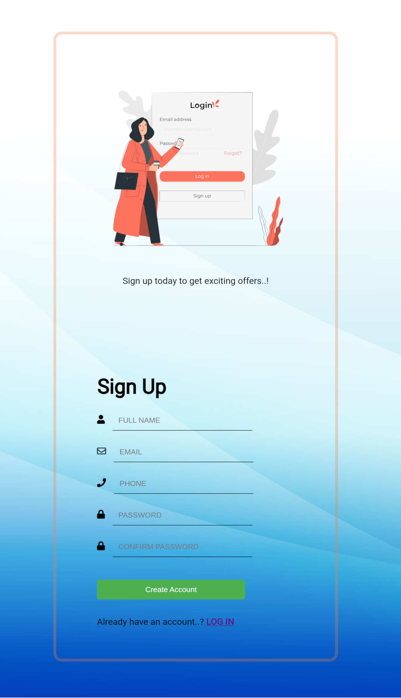

# Sign-up-Form

The Odin Project Sign-up Form project solution.

This is a solution to the [Sign-up Form project in The Odin Project curriculum](https://www.theodinproject.com/lessons/node-path-intermediate-html-and-css-sign-up-form).

## Table of contents

- [Overview](#overview)
  - [The challenge](#the-challenge)
  - [Screenshot](#screenshot)
  - [Links](#links)
- [My process](#my-process)
  - [Built with](#built-with)
  - [Tools used](#tools-used)
  - [Features](#features)
  - [What I learned](#what-i-learned)
  - [Continued development](#continued-development)
  - [Useful resources](#useful-resources)
- [Author](#author)
- [Acknowledgments](#acknowledgments)

## Overview

### The challenge

The project:

- Should have a large background image.
- Should incorporate an image or logo in the sidebar section.
- Apply a dark, semi-transparent background to enhance text readability.
- Create Account Button: There should be a "Create Account" button with a color similar to tones found in the background image
- Responsive Design: While the primary focus is on desktop resolutions, the layout remains functional and visually appealing at different screen sizes.
- Validation (optional): There should be a JavaScript validation to check if password fields match or validate each field separately.

### Screenshot

### Links

- Source code URL: https://github.com/nuru484/Sign-up-Form
- Live Site URL: https://nuru484.github.io/Sign-up-Form/

## My process

### Built with

- 
- 
- 

### Tools Used

- 
- 
- 

### Features

- Responsive on both desktop and mobiles.
- User friendly interface.
- Password validation to ensure it's strong and also matches the confirm password.

### What I learned

- Learnt a bit of responsive design and how to make sites responsive with little or no media queries at all.
- Learnt how to manipulate flexbox for responsive design.
- I also learnt some advanced CSS selectors and HTML forms and how to create forms to ensure site security.
- Learnt how to validate user inputs using HTML and also JavaScript.

### Continued development

- To show a new interface after the form data has been submitted.
- All though it looks nice when viewed on mobile devices, it doesn't fit that much and I'm working to ensure that.
- Style the alerts for the validations.
- And any other feature worth adding

### Useful resources

- [OpenAI](https://chat.openai.com/?model=text-davinci-002-render-sha) - I use ChatGPT to get simple explanations of complex syntax and the ones I just met.
- [Stack] (https://stackoverflow.com/questions/8664486/javascript-code-to-stop-form-submission) - I use get some clean code for some features I struggled to come by with some poor code.

## Author

- Twitter - [@ABDULMAJEEDNUR3](https://twitter.com/ABDULMAJEEDNUR3)
- GitHub - [@Nuru484](https://github.com/nuru484)

## Acknowledgments

- Inspiration by [The Odin Project](https://www.theodinproject.com/)
- Background image by [Freepik] (https://www.freepik.com/free-vector/blue-curve-background_16282276.htm#&position=16&from_view=popular) .
- Illustrative vectors was provided by [Storyset] (https://storyset.com/) .

Big thanks to myself for not giving up on this journey, I shall get there someday, Insha Allah.
